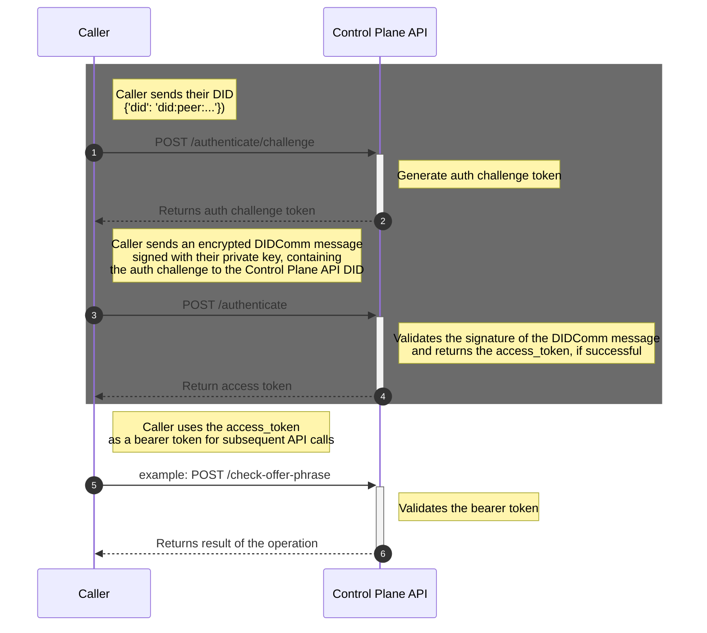

# Authentication

Calling all API endpoints available in the Control Plane API requires an access token as part of the request header, except for endpoints responsible for authentication. 

For authenticated calls, the API expects a **Bearer Token** to be present in the `Authorization` field of the request header. To obtain an access token, it requires two authentication requests.

* `/authenticate/challenge`
* `/authenticate`

Referring to the sequence diagram below, the caller obtains an access token by completing the `/authenticate/challenge` and `/authenticate` calls. 

The caller must provide a DID to use as their primary identifier for all calls, then prove they hold the private key for this DID as part of the authentication challenge process.

After successfully obtaining the access token, include it in the request header on all subsequent calls to the Control Plane API that require authentication.

See the example Dart code for the authentication flow [here](../test/utils/authoritzation.dart).
