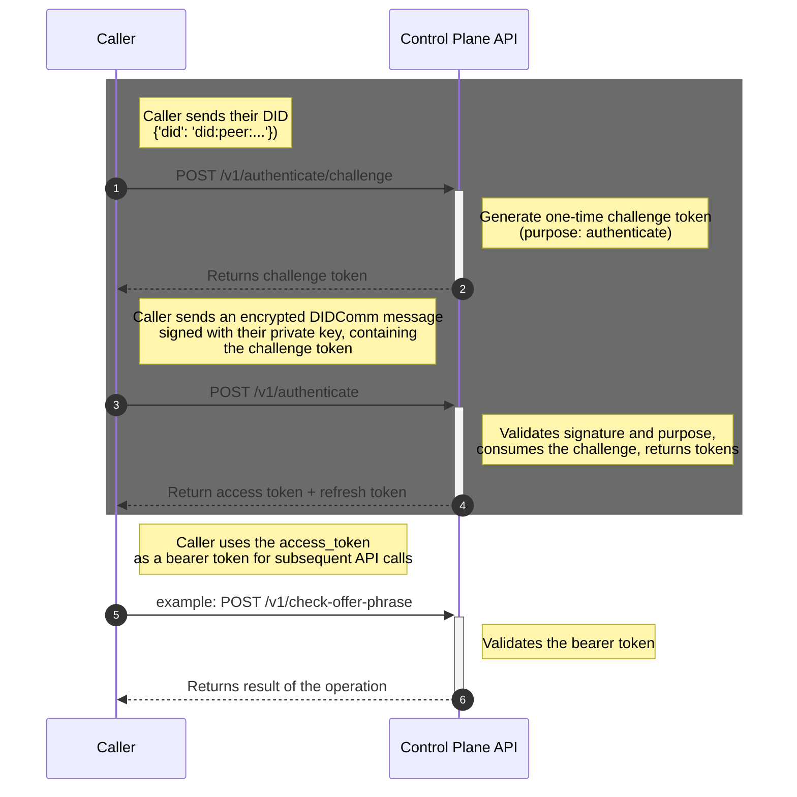
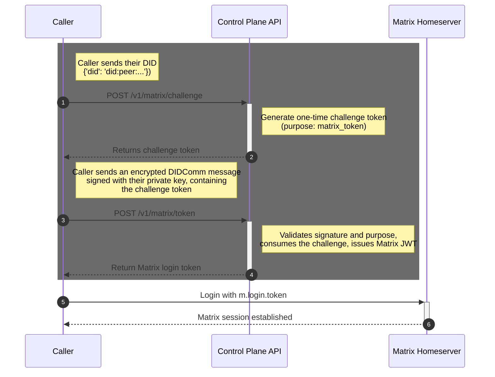

# Authentication

Calling all API endpoints available in the Control Plane API requires an access token as part of the request header, except for endpoints responsible for authentication.

For authenticated calls, the API expects a **Bearer Token** to be present in the `Authorization` field of the request header.

## Challenge token security

All challenge tokens share the following properties:

- **One-time use** — each challenge contains a unique `jti` claim. The token is invalidated on first use and cannot be replayed.
- **Purpose-bound** — each challenge carries a `purpose` claim that binds it to a specific endpoint. A challenge issued for one endpoint is rejected by any other.
- **Short-lived** — challenges expire after 60 seconds.

## Control Plane authentication

To obtain an access token, complete two requests using the **authenticate** challenge endpoint:

* `POST /v1/authenticate/challenge` — issues a challenge with `purpose: authenticate`
* `POST /v1/authenticate` — exchanges the signed challenge response for an access and refresh token

```mermaid
sequenceDiagram
    autonumber
    participant Caller
    participant API as Control Plane API

    rect rgb(107, 107, 107)
    note right of Caller: Caller sends their DID<br/>{'did': 'did:peer:...'});
    Caller->>+API: POST /v1/authenticate/challenge
    note right of API: Generate one-time challenge token<br/>(purpose: authenticate)
    API-->>-Caller: Returns challenge token

    note right of Caller: Caller sends an encrypted DIDComm message<br/> signed with their private key, containing<br/> the challenge token
    Caller->>+API: POST /v1/authenticate
    note right of API: Validates signature and purpose,<br/>consumes the challenge, returns tokens
    API-->>-Caller: Return access token + refresh token
    end
    note right of Caller: Caller uses the access_token<br/>as a bearer token for subsequent API calls
    Caller->>+API: example: POST /v1/check-offer-phrase
    note right of API: Validates the bearer token
    API-->>-Caller: Returns result of the operation

```

## Matrix token authentication

To obtain a Matrix login token (`m.login.token`), use the **matrix** challenge endpoint:

* `POST /v1/matrix/challenge` — issues a challenge with `purpose: matrix_token`
* `POST /v1/matrix/token` — exchanges the signed challenge response for a Matrix login token

```mermaid
sequenceDiagram
    autonumber
    participant Caller
    participant API as Control Plane API
    participant Matrix as Matrix Homeserver

    rect rgb(107, 107, 107)
    note right of Caller: Caller sends their DID<br/>{'did': 'did:peer:...'});
    Caller->>+API: POST /v1/matrix/challenge
    note right of API: Generate one-time challenge token<br/>(purpose: matrix_token)
    API-->>-Caller: Returns challenge token

    note right of Caller: Caller sends an encrypted DIDComm message<br/> signed with their private key, containing<br/> the challenge token
    Caller->>+API: POST /v1/matrix/token
    note right of API: Validates signature and purpose,<br/>consumes the challenge, issues Matrix JWT
    API-->>-Caller: Return Matrix login token
    end
    Caller->>+Matrix: Login with m.login.token
    Matrix-->>-Caller: Matrix session established

```

See the example Dart code for the authentication flow [here](../test/utils/authoritzation.dart).
